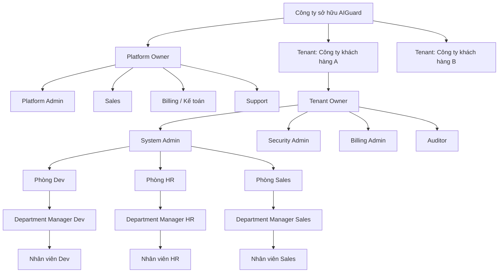
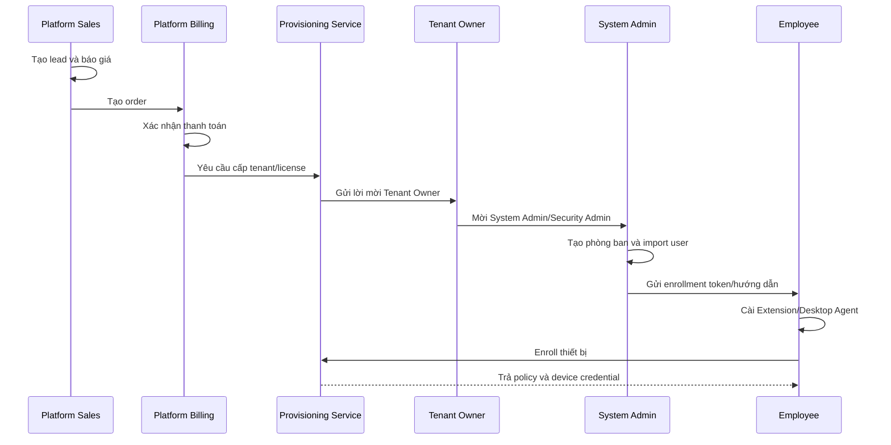

# AIGuard - Mô hình vận hành doanh nghiệp, tài khoản và phân quyền quản trị

## 1. Mục đích tài liệu

Tài liệu này xác định chính xác:

- Ai là chủ sở hữu nền tảng AIGuard.
- Ai là chủ doanh nghiệp khách hàng.
- Ai là admin quản lý toàn bộ website.
- Ai được tạo và quản lý tài khoản phụ.
- Quản lý phòng ban được nhìn thấy và phê duyệt dữ liệu nào.
- Nhân viên được sử dụng những chức năng nào.
- AIGuard phải tách dữ liệu giữa các doanh nghiệp ra sao.
- Quy trình từ lúc khách mua gói đến lúc nhân viên được cài Extension/Desktop Agent.
- Trách nhiệm của từng vai trò trong vận hành, bảo mật, thanh toán, license và hỗ trợ.

Đây là tài liệu nghiệp vụ nền tảng cho:

- Thiết kế database.
- Thiết kế JWT và RBAC.
- Thiết kế API.
- Thiết kế menu frontend.
- Thiết kế quy trình tạo tenant.
- Thiết kế quản lý license và thanh toán.
- Thiết kế audit log.
- Thiết kế kiểm soát dữ liệu nhiều doanh nghiệp.

---

## 2. Kết luận nghiệp vụ quan trọng nhất

AIGuard phải được thiết kế theo mô hình **SaaS Multi-tenant**.

Trong mô hình này có hai tầng quản trị hoàn toàn khác nhau:

1. **Tầng chủ nền tảng AIGuard**
   - Là công ty sở hữu và vận hành sản phẩm AIGuard.
   - Quản lý website, khách hàng, tenant, subscription, license, thanh toán và hạ tầng.
   - Không mặc định được đọc prompt hoặc dữ liệu nhạy cảm của khách hàng.

2. **Tầng doanh nghiệp khách hàng**
   - Mỗi doanh nghiệp là một `Tenant`.
   - Có chủ doanh nghiệp hoặc người đại diện quản trị.
   - Tự quản lý admin, phòng ban, quản lý và nhân viên của doanh nghiệp mình.
   - Chỉ được xem dữ liệu nằm trong tenant của mình.

### 2.1. Ai là admin chủ toàn bộ website?

Admin chủ toàn bộ website phải là:

> **Platform Owner / Platform Super Admin**

Đây là tài khoản thuộc công ty AIGuard, không thuộc doanh nghiệp khách hàng.

Platform Owner có quyền:

- Tạo và khóa tenant khách hàng.
- Quản lý gói dịch vụ.
- Xác nhận đơn hàng.
- Cấp hoặc thu hồi license.
- Quản lý tài khoản nhân viên nội bộ của AIGuard.
- Theo dõi trạng thái hạ tầng toàn hệ thống.
- Quản lý phiên bản sản phẩm.
- Xử lý sự cố cấp nền tảng.

Platform Owner không nên mặc định có quyền:

- Đọc prompt gốc của nhân viên khách hàng.
- Xem nội dung file khách hàng đã quét.
- Đọc dữ liệu khách hàng trong Exact Data Match.
- Tự ý thay đổi policy bảo mật của tenant.
- Tự ý đăng nhập dưới danh nghĩa admin khách hàng.

Nếu cần hỗ trợ kỹ thuật sâu, phải dùng cơ chế `Support Access` có:

- Sự đồng ý của Tenant Owner.
- Phạm vi quyền cụ thể.
- Thời gian hết hạn.
- Lý do truy cập.
- Audit log đầy đủ.

### 2.2. Ai là chủ doanh nghiệp khách hàng?

Trong AIGuard, chủ doanh nghiệp hoặc người đại diện được gọi là:

> **Tenant Owner**

Tenant Owner có thể là:

- Chủ doanh nghiệp.
- Tổng giám đốc.
- CTO.
- CISO.
- Trưởng phòng IT được ủy quyền.
- Người đại diện ký hợp đồng sử dụng AIGuard.

Tenant Owner là tài khoản cao nhất trong phạm vi một doanh nghiệp, nhưng không được quản lý tenant khác.

### 2.3. System Admin là ai?

`SystemAdmin` nên được hiểu là:

> Quản trị viên hệ thống của một doanh nghiệp khách hàng.

System Admin quản lý:

- Người dùng trong tenant.
- Phòng ban trong tenant.
- Vai trò và phân quyền.
- Thiết bị.
- Extension/Desktop Agent deployment.
- SSO.
- MFA.
- Cấu hình kỹ thuật của tenant.

System Admin không phải là chủ toàn bộ website AIGuard.

### 2.4. Điều chỉnh cần thực hiện so với role hiện tại

Role hiện tại trong dự án:

- `Employee`
- `DepartmentManager`
- `SecurityAdmin`
- `SystemAdmin`
- `Auditor`

Các role này mới mô tả quyền trong một doanh nghiệp khách hàng.

Để vận hành SaaS đúng nghiệp vụ, cần bổ sung tầng platform:

- `PlatformOwner`
- `PlatformAdmin`
- `PlatformSales`
- `PlatformBilling`
- `PlatformSupport`

Đồng thời nên bổ sung role tenant:

- `TenantOwner`
- `BillingAdmin`
- `AgentOwner` hoặc `AgentOperator`

---

## 3. Cấu trúc tổ chức tổng thể



Nguyên tắc:

- Platform quản lý tenant.
- Tenant quản lý phòng ban.
- Phòng ban quản lý nhân viên.
- Mọi dữ liệu nghiệp vụ phải gắn với `TenantId`.
- Dữ liệu phòng ban phải gắn thêm `DepartmentId` khi cần.

---

## 4. Các thực thể nghiệp vụ chính

### 4.1. Platform

Platform là toàn bộ hệ thống AIGuard do nhà cung cấp vận hành.

Platform quản lý:

- Danh sách tenant.
- Gói dịch vụ.
- Đơn hàng.
- Thanh toán.
- Subscription.
- License.
- Hạ tầng API.
- Phiên bản Extension.
- Phiên bản Desktop Agent.
- Tích hợp payment.
- Tình trạng dịch vụ.

### 4.2. Tenant

Tenant là một doanh nghiệp khách hàng độc lập.

Ví dụ:

- `TENANT-SAOVIET`
- `TENANT-FINTRUST`
- `TENANT-HRPLUS`

Mỗi tenant có:

- Tên doanh nghiệp.
- Mã tenant.
- Domain email.
- Tenant Owner.
- Gói dịch vụ.
- Ngày bắt đầu và hết hạn.
- Giới hạn user.
- Giới hạn thiết bị.
- Giới hạn AI Agent.
- Chính sách retention.
- Cấu hình SSO.
- Cấu hình SIEM.
- Trạng thái hoạt động.

### 4.3. Department

Department là phòng ban thuộc một tenant.

Ví dụ:

- Dev.
- HR.
- Sales.
- Kế toán.
- Pháp chế.
- Ban giám đốc.

Không được dùng chung Department giữa hai tenant.

### 4.4. User

User là tài khoản đăng nhập AIGuard.

Mỗi user phải có:

- `UserId`.
- `TenantId`.
- `Email`.
- `FullName`.
- `Role`.
- `DepartmentId`.
- `ManagerId` nếu áp dụng.
- `Status`.
- `AuthProvider`.
- `MfaEnabled`.
- `CreatedBy`.
- `CreatedAt`.

### 4.5. Device

Device là máy nhân viên đã cài Extension hoặc Desktop Agent.

Mỗi thiết bị phải gắn:

- `TenantId`.
- `AssignedUserId`.
- `DepartmentId`.
- `Hostname`.
- `DeviceId`.
- `ExtensionVersion`.
- `AgentVersion`.
- `PolicyVersion`.
- `LastSeen`.
- `EnrollmentStatus`.
- `RiskStatus`.

### 4.6. AI Agent

AI Agent là tác nhân tự động thuộc tenant.

Mỗi Agent phải có:

- `TenantId`.
- `AgentOwnerId`.
- `DepartmentId`.
- Credential riêng.
- Tool permissions.
- Domain/email allowlist.
- Quota.
- Kill switch.
- Audit log.

### 4.7. Subscription và License

Subscription thể hiện quan hệ thương mại.

License thể hiện quyền sử dụng kỹ thuật.

Một tenant có thể:

- Có một subscription chính.
- Có nhiều add-on.
- Có nhiều license theo môi trường.
- Có license Production, Staging hoặc Pilot.

---

## 5. Hệ thống vai trò cấp Platform

## 5.1. Platform Owner

Đây là tài khoản cao nhất của công ty AIGuard.

### Có quyền

- Quản lý toàn bộ Platform Admin.
- Quản lý tenant.
- Quản lý gói sản phẩm.
- Quản lý license.
- Quản lý billing.
- Xem doanh thu.
- Xem tình trạng toàn hệ thống.
- Cấu hình payment gateway.
- Cấu hình email, SMS, Teams, Slack.
- Cấu hình blockchain toàn nền tảng.
- Khóa tenant vi phạm hợp đồng.
- Phê duyệt support access đặc biệt.

### Không nên làm hàng ngày

- Không trực tiếp quản lý nhân viên của khách hàng.
- Không trực tiếp sửa policy khách hàng.
- Không xem prompt gốc nếu không có quyền support đặc biệt.

### Số lượng đề xuất

- Chỉ 1-3 tài khoản.
- Bắt buộc MFA.
- Bắt buộc hardware key nếu triển khai production lớn.
- Không dùng tài khoản này cho công việc hỗ trợ thông thường.

## 5.2. Platform Admin

Phụ trách vận hành kỹ thuật nền tảng.

### Có quyền

- Tạo tenant theo đơn hàng đã duyệt.
- Khóa/mở tenant.
- Cấp license.
- Kiểm tra health hệ thống.
- Quản lý version Extension/Agent.
- Quản lý webhook.
- Xử lý sự cố cấp platform.

### Không có quyền

- Xóa audit log.
- Xem dữ liệu tenant không cần thiết.
- Xác nhận doanh thu nếu không có quyền Billing.

## 5.3. Platform Sales

Phụ trách khách hàng và đơn hàng.

### Có quyền

- Tạo lead.
- Tạo customer CRM.
- Tạo quotation.
- Tạo order.
- Chọn gói và số user.
- Theo dõi trial.
- Theo dõi trạng thái hợp đồng.
- Gửi báo giá.
- Chuyển khách sang onboarding.

### Không có quyền

- Xem prompt hoặc audit log bảo mật.
- Sửa policy.
- Cấp quyền admin.
- Khóa thiết bị.

## 5.4. Platform Billing

Phụ trách thanh toán và hóa đơn.

### Có quyền

- Xem order.
- Xem biên lai.
- Đối soát thanh toán.
- Xác nhận đã thanh toán.
- Xuất invoice/VAT.
- Theo dõi công nợ.
- Gửi nhắc gia hạn.

### Không có quyền

- Quản lý policy.
- Xem DLP event chi tiết.
- Xem dữ liệu nhân viên khách hàng.

## 5.5. Platform Support

Phụ trách hỗ trợ khách hàng.

### Có quyền mặc định

- Xem ticket.
- Xem thông tin tenant cơ bản.
- Xem version Extension/Agent.
- Xem health không chứa dữ liệu nhạy cảm.
- Hướng dẫn cài đặt.

### Support Access nâng cao

Nếu cần truy cập sâu:

1. Support tạo yêu cầu truy cập.
2. Tenant Owner hoặc System Admin phê duyệt.
3. Hệ thống cấp quyền tạm thời.
4. Quyền tự hết hạn.
5. Toàn bộ thao tác được audit.

---

## 6. Hệ thống vai trò cấp Tenant

## 6.1. Tenant Owner

Tenant Owner là chủ doanh nghiệp hoặc người đại diện cao nhất.

### Có quyền

- Xem thông tin hợp đồng.
- Xem gói và license.
- Mời hoặc khóa System Admin.
- Mời hoặc khóa Security Admin.
- Mời Billing Admin.
- Xem báo cáo tổng quan.
- Phê duyệt support access.
- Chuyển quyền Tenant Owner.
- Yêu cầu đóng tenant.

### Không nên trực tiếp xử lý

- Duyệt từng prompt hàng ngày.
- Cấu hình từng detector.
- Xử lý từng thiết bị.

Tenant Owner là quyền sở hữu và giám sát, không nhất thiết là người vận hành kỹ thuật.

## 6.2. System Admin

System Admin quản trị tổ chức và kỹ thuật trong tenant.

### Có quyền

- CRUD phòng ban.
- CRUD user.
- Gán role.
- Import user CSV/Excel.
- Khóa/mở tài khoản.
- Reset MFA.
- Cấu hình SSO.
- Tạo enrollment token.
- Quản lý thiết bị.
- Thu hồi endpoint key.
- Quarantine thiết bị.
- Quản lý domain công ty.
- Quản lý cấu hình tenant.

### Không có quyền mặc định

- Duyệt hóa đơn nếu không có Billing role.
- Xem prompt gốc đã bị mask nếu không có quyền đặc biệt.
- Thay đổi bằng chứng audit.

## 6.3. Security Admin

Security Admin chịu trách nhiệm chính sách bảo mật.

### Có quyền

- Xem dashboard rủi ro.
- Tạo và publish policy.
- Quản lý detector.
- Quản lý whitelist/blacklist.
- Xử lý false positive.
- Xem incident.
- Quản lý Shadow AI.
- Quản lý AI Agent policy.
- Chặn tool-call.
- Kích hoạt kill switch Agent.
- Xuất báo cáo bảo mật.

### Giới hạn

- Không tạo System Admin.
- Không thay đổi hợp đồng.
- Không xác nhận thanh toán.
- Không được xóa audit log.

## 6.4. Department Manager

Department Manager chỉ quản lý một hoặc nhiều phòng ban được gán.

### Có quyền

- Xem dashboard phòng ban.
- Xem danh sách nhân viên thuộc phòng ban.
- Xem yêu cầu phê duyệt của nhân viên thuộc phạm vi.
- Approve.
- Reject.
- Approve With Masking.
- Xem lịch sử phê duyệt của phòng ban.
- Xem sự cố thuộc phòng ban.

### Không có quyền

- Xem dữ liệu phòng ban khác.
- Tạo System Admin.
- Sửa policy toàn doanh nghiệp.
- Xem billing.
- Xem Exact Data Match nguồn.

## 6.5. Employee

Employee là nhân viên sử dụng AIGuard.

### Có quyền

- Đăng nhập Portal cá nhân.
- Xem trạng thái Extension/Desktop Agent.
- Xem lịch sử sử dụng của chính mình.
- Xem prompt bị chặn của chính mình.
- Gửi yêu cầu phê duyệt.
- Xem kết quả approve/reject.
- Báo cáo chặn nhầm.
- Cập nhật profile cá nhân giới hạn.
- Tạo support ticket nếu được cho phép.

### Không có quyền

- Xem log của người khác.
- Xem prompt của người khác.
- Sửa policy.
- Tắt bảo vệ.
- Tự cấp whitelist.
- Tự approve yêu cầu của mình.

## 6.6. Auditor

Auditor là người kiểm toán nội bộ hoặc bên thứ ba.

### Có quyền

- Xem audit log ở chế độ read-only.
- Xác minh blockchain hash.
- Xem lịch sử thay đổi policy.
- Xem lịch sử phê duyệt.
- Xuất báo cáo kiểm toán.
- Xem bằng chứng cấu hình.

### Không có quyền

- Sửa dữ liệu.
- Approve prompt.
- Khóa user.
- Thay đổi policy.
- Xóa incident.

## 6.7. Billing Admin

Billing Admin là kế toán hoặc người phụ trách hợp đồng của tenant.

### Có quyền

- Xem gói hiện tại.
- Xem invoice.
- Tải báo giá.
- Tải hợp đồng.
- Upload biên lai.
- Xem lịch sử thanh toán.
- Yêu cầu nâng cấp gói.
- Gia hạn subscription.

### Không có quyền

- Xem prompt.
- Xem DLP event.
- Sửa policy.
- Quản lý thiết bị.

## 6.8. Agent Owner

Agent Owner là người chịu trách nhiệm nghiệp vụ cho một AI Agent.

### Có quyền

- Xem Agent được giao.
- Xem tool-call.
- Xem quota.
- Xem incident của Agent.
- Yêu cầu mở thêm tool permission.
- Tạm dừng Agent trong phạm vi cho phép.

### Không có quyền

- Tự cấp tool nguy hiểm.
- Tự bỏ kill switch.
- Xem Agent của phòng ban khác.

---

## 7. Ai được tạo tài khoản cho ai?

| Người thực hiện | Được tạo/quản lý |
|---|---|
| Platform Owner | Platform Admin, Platform Sales, Platform Billing, Platform Support |
| Platform Admin | Tenant ban đầu theo order đã duyệt; không tự ý tạo nhân viên tenant |
| Tenant Owner | System Admin, Security Admin, Billing Admin, Auditor |
| System Admin | Department Manager, Employee, Auditor theo chính sách tenant |
| Security Admin | Không mặc định được tạo System Admin; có thể mời Security Operator nếu có permission |
| Department Manager | Có thể đề xuất/mời Employee vào phòng ban, nhưng System Admin xác nhận |
| Employee | Không được tạo tài khoản khác |
| Billing Admin | Không được tạo tài khoản bảo mật |
| Auditor | Không được tạo tài khoản |

### 7.1. Nguyên tắc chống tự nâng quyền

- User không được sửa role của chính mình.
- System Admin không được tự nâng thành Tenant Owner.
- Security Admin không được tự cấp Billing.
- Department Manager không được tự thêm phòng ban khác vào phạm vi.
- Platform Support không được tự cấp Support Access.
- Mọi thay đổi role quan trọng phải tạo audit log.

---

## 8. Cây tài khoản trong một doanh nghiệp

Ví dụ tenant `Công ty Sao Việt Tech`:

```text
Tenant Owner
|
+-- System Admin
|   |
|   +-- Department: Dev
|   |   +-- Dev Manager
|   |       +-- Dev Employee 01
|   |       +-- Dev Employee 02
|   |
|   +-- Department: HR
|   |   +-- HR Manager
|   |       +-- HR Employee 01
|   |
|   +-- Department: Sales
|       +-- Sales Manager
|           +-- Sales Employee 01
|
+-- Security Admin
|   +-- Security Operator
|
+-- Billing Admin
|
+-- Auditor
```

### 8.1. Manager không phải admin hệ thống

Manager chỉ quản lý con người và approval trong phạm vi phòng ban.

Manager không nên:

- Tạo tenant.
- Cấp license.
- Tạo policy toàn doanh nghiệp.
- Cấu hình SSO.
- Xem dữ liệu phòng ban khác.

### 8.2. Nhân viên là tài khoản cấp cuối

Nhân viên:

- Được gán một phòng ban chính.
- Có thể có một quản lý trực tiếp.
- Có thiết bị được đăng ký.
- Nhận policy theo tenant + phòng ban + user + device.

---

## 9. Ma trận quyền tổng quát

| Chức năng | Platform Owner | Tenant Owner | System Admin | Security Admin | Manager | Employee | Auditor | Billing Admin |
|---|---:|---:|---:|---:|---:|---:|---:|---:|
| Quản lý tenant | Có | Không | Không | Không | Không | Không | Không | Không |
| Quản lý gói/license toàn platform | Có | Không | Không | Không | Không | Không | Không | Không |
| Xem hợp đồng tenant | Theo quyền | Có | Có giới hạn | Không | Không | Không | Read-only | Có |
| Tạo admin tenant | Không trực tiếp | Có | Có giới hạn | Không | Không | Không | Không | Không |
| Tạo phòng ban | Không | Có | Có | Không | Không | Không | Không | Không |
| Tạo nhân viên | Không | Có | Có | Không | Đề xuất | Không | Không | Không |
| Quản lý thiết bị | Không mặc định | Xem | Có | Có | Theo phòng ban | Thiết bị của mình | Read-only | Không |
| Tạo policy | Không | Xem | Có giới hạn | Có | Không | Không | Read-only | Không |
| Publish policy | Không | Xem | Theo quyền | Có | Không | Không | Read-only | Không |
| Duyệt prompt | Không | Theo quyền | Có | Có | Theo phòng ban | Không | Read-only | Không |
| Xem prompt gốc | Không mặc định | Theo policy | Theo policy | Theo policy | Theo phòng ban | Prompt của mình | Masked/metadata | Không |
| Xử lý false positive | Không | Xem | Có | Có | Đề xuất | Báo cáo | Read-only | Không |
| Quản lý AI Agent | Không | Xem | Có | Có | Theo phạm vi | Không | Read-only | Không |
| Xem audit log | Platform log | Tenant log | Có | Có | Giới hạn | Log cá nhân | Có | Billing log |
| Xóa audit log | Không | Không | Không | Không | Không | Không | Không | Không |
| Xác nhận thanh toán | Platform Billing | Không | Không | Không | Không | Không | Không | Upload/xem |

---

## 10. Phạm vi dữ liệu theo vai trò

Quyền không chỉ dựa vào role. Mỗi request phải kiểm tra:

1. `PlatformScope` hoặc `TenantScope`.
2. `TenantId`.
3. `DepartmentId`.
4. `UserId`.
5. `ResourceOwnerId`.
6. Permission cụ thể.

### 10.1. Platform scope

Tài khoản platform có claim:

```json
{
  "scope": "platform",
  "role": "PlatformAdmin"
}
```

### 10.2. Tenant scope

Tài khoản tenant có claim:

```json
{
  "scope": "tenant",
  "tenantId": "tenant-sao-viet",
  "role": "SecurityAdmin",
  "departmentId": "security",
  "permissions": [
    "policy.read",
    "policy.write",
    "incident.manage"
  ]
}
```

### 10.3. Quy tắc truy vấn bắt buộc

Mọi truy vấn tenant phải có điều kiện:

```text
WHERE TenantId = CurrentUser.TenantId
```

Nếu là Manager:

```text
WHERE TenantId = CurrentUser.TenantId
AND DepartmentId IN CurrentUser.ManagedDepartmentIds
```

Nếu là Employee:

```text
WHERE TenantId = CurrentUser.TenantId
AND UserId = CurrentUser.UserId
```

Không được tin `TenantId` do frontend gửi lên.

Backend phải lấy `TenantId` từ:

- JWT đã ký.
- API key đã ký.
- Device enrollment identity.
- Agent credential.

---

## 11. Quy trình khách hàng mua và bắt đầu sử dụng



### 11.1. Bước 1 - Sales tạo khách hàng

Sales nhập:

- Tên doanh nghiệp.
- Người liên hệ.
- Email.
- Số điện thoại.
- Quy mô user.
- Số thiết bị.
- Gói đề xuất.
- Mô hình SaaS/private cloud/on-premise.

### 11.2. Bước 2 - Tạo báo giá

Báo giá có:

- Gói sản phẩm.
- Số user.
- Add-on.
- Phí triển khai.
- Discount.
- Thuế.
- Điều khoản.
- Thời hạn báo giá.

### 11.3. Bước 3 - Xác nhận thanh toán

Billing:

- Nhận webhook hoặc biên lai.
- Đối soát số tiền.
- Kiểm tra nội dung chuyển khoản.
- Chuyển order sang `Paid`.

### 11.4. Bước 4 - Provision tenant

Hệ thống tự động:

- Tạo Tenant.
- Tạo Subscription.
- Tạo License.
- Gửi invitation cho Tenant Owner.
- Tạo audit event.

### 11.5. Bước 5 - Tenant Owner thiết lập đội ngũ

Tenant Owner:

- Mời System Admin.
- Mời Security Admin.
- Mời Billing Admin.
- Xác nhận domain doanh nghiệp.

### 11.6. Bước 6 - System Admin tạo account phụ

System Admin:

- Tạo phòng ban.
- Tạo Manager.
- Import Employee.
- Gán phòng ban.
- Gán thiết bị.
- Tạo enrollment token.

### 11.7. Bước 7 - Security Admin cấu hình bảo vệ

Security Admin:

- Chọn policy template.
- Điều chỉnh detector.
- Thiết lập mức Low/Medium/High/Critical.
- Publish policy.
- Test policy.

### 11.8. Bước 8 - Nhân viên enroll thiết bị

Nhân viên:

- Cài Extension/Desktop Agent.
- Nhập enrollment token.
- Đăng nhập.
- Thiết bị nhận policy.
- AIGuard bắt đầu kiểm soát ChatGPT/Gemini/Claude.

---

## 12. Quy trình phê duyệt prompt

### 12.1. Low

- Cho phép gửi.
- Lưu metadata audit theo retention.

### 12.2. Medium

- Tự động mask.
- Nhân viên được dùng bản đã che.

### 12.3. High

- Tạo yêu cầu phê duyệt.
- Department Manager là người duyệt đầu tiên.
- Security Admin là người duyệt dự phòng hoặc escalation.

### 12.4. Critical

- Chặn.
- Không cho Manager bỏ chặn trực tiếp nếu policy không cho phép.
- Security Admin xử lý incident hoặc whitelist có kiểm soát.

### 12.5. Chống tự duyệt

- Người tạo yêu cầu không được duyệt yêu cầu của chính mình.
- Manager không được duyệt ngoài phòng ban.
- Approval phải có thời hạn.
- Approval phải gắn hash nội dung đã scan.
- Sửa prompt sau approval phải scan lại.

---

## 13. Quy trình quản lý account phụ

### 13.1. Tạo account

1. Admin nhập email hoặc import CSV/Excel.
2. Backend kiểm tra domain.
3. Backend kiểm tra quota license.
4. Tạo user ở trạng thái `Invited`.
5. Gửi invitation.
6. User đặt mật khẩu hoặc đăng nhập SSO.
7. Bật MFA nếu role yêu cầu.
8. Chuyển sang `Active`.

### 13.2. Chuyển phòng ban

Khi user đổi phòng ban:

- Cập nhật `DepartmentId`.
- Thu hồi policy cache cũ.
- Đồng bộ policy mới.
- Chuyển manager.
- Không chuyển quyền truy cập lịch sử không phù hợp.
- Audit toàn bộ thay đổi.

### 13.3. Khóa nhân viên

Khi nhân viên nghỉ việc:

1. Chuyển user sang `Suspended`.
2. Thu hồi refresh token.
3. Thu hồi enrollment token.
4. Thu hồi endpoint credential.
5. Quarantine thiết bị nếu cần.
6. Chuyển approval đang chờ sang manager khác.
7. Giữ audit log theo retention.

### 13.4. Xóa account

Không nên xóa cứng ngay.

Nên:

- `Soft Delete`.
- Ẩn khỏi danh sách active.
- Giữ audit reference.
- Anonymize dữ liệu cá nhân sau retention nếu pháp luật/hợp đồng yêu cầu.

---

## 14. Trạng thái tài khoản

| Trạng thái | Ý nghĩa |
|---|---|
| Invited | Đã mời, chưa kích hoạt |
| Active | Đang hoạt động |
| Suspended | Bị tạm khóa |
| Locked | Bị khóa do bảo mật |
| Offboarded | Đã nghỉ việc/rời tenant |
| Deleted | Đã soft-delete |

Không nên chỉ dùng một trường `IsActive`.

Production nên có:

- `Status`.
- `LockedReason`.
- `LockedAt`.
- `OffboardedAt`.
- `DeletedAt`.

---

## 15. Trạng thái tenant

| Trạng thái | Ý nghĩa |
|---|---|
| Trial | Đang dùng thử |
| PendingPayment | Chờ thanh toán |
| Provisioning | Đang tạo tài nguyên |
| Active | Đang hoạt động |
| GracePeriod | Đã quá hạn nhưng còn thời gian gia hạn |
| Suspended | Bị tạm dừng |
| Terminated | Đã chấm dứt |

### Khi tenant hết hạn

- Không xóa dữ liệu ngay.
- Chặn tạo user mới.
- Chặn enroll thiết bị mới.
- Có thể giữ bảo vệ endpoint ở chế độ an toàn trong grace period.
- Cho Billing Admin tải invoice.
- Gửi cảnh báo cho Tenant Owner.
- Sau retention mới thực hiện xóa/anonymize.

---

## 16. Menu frontend theo vai trò

### 16.1. Platform Owner

- Platform Dashboard.
- Tenants.
- Plans & Pricing.
- Orders.
- Payments.
- Licenses.
- Platform Users.
- Product Releases.
- Platform Health.
- Global Audit.
- Support Access.
- Platform Settings.

### 16.2. Tenant Owner

- Executive Dashboard.
- Subscription.
- Billing.
- Admin Users.
- Security Summary.
- Audit Summary.
- Support Access.
- Tenant Settings.

### 16.3. System Admin

- Dashboard.
- Users & Departments.
- Devices.
- Deployment.
- SSO/MFA.
- Tenant Settings.
- Enrollment Tokens.
- System Health.

### 16.4. Security Admin

- Security Dashboard.
- DLP Events.
- Policies.
- Detectors.
- False Positives.
- Incident Management.
- AI Agent Control Tower.
- Audit & Blockchain.
- SIEM.

### 16.5. Department Manager

- Department Dashboard.
- Prompt Approvals.
- Agent Approvals.
- Department Events.
- Approval History.
- Team Users.

### 16.6. Employee

- My Usage.
- My Approvals.
- My Devices.
- Extension Status.
- Report False Positive.
- Profile.
- Support.

### 16.7. Auditor

- Read-only Dashboard.
- Audit Logs.
- Policy History.
- Approval History.
- Blockchain Verification.
- Export Reports.

### 16.8. Billing Admin

- Subscription.
- Orders.
- Invoices.
- Payments.
- Contracts.
- Upgrade/Renewal.

---

## 17. Database production đề xuất

### 17.1. Bảng PlatformsUsers

```text
Id
Email
FullName
PlatformRole
Status
MfaEnabled
CreatedAt
LastLoginAt
```

Không nên lưu platform user chung logic với tenant user nếu hệ thống cần cách ly mạnh.

### 17.2. Bảng Tenants

```text
Id
Code
Name
PrimaryDomain
OwnerUserId
Status
PlanId
LicenseId
DataRegion
RetentionDays
CreatedAt
SuspendedAt
TerminatedAt
```

### 17.3. Bảng TenantUsers

```text
Id
TenantId
Email
FullName
DepartmentId
ManagerId
RoleId
Status
AuthProvider
MfaEnabled
CreatedBy
CreatedAt
OffboardedAt
```

### 17.4. Bảng Roles

```text
Id
TenantId NULL
Code
Name
Scope
IsSystemRole
CreatedAt
```

`TenantId = NULL` dùng cho role platform hoặc role mẫu hệ thống.

### 17.5. Bảng Permissions

```text
Id
Code
Name
Resource
Action
```

Ví dụ:

- `tenant.user.create`
- `tenant.user.lock`
- `policy.publish`
- `approval.prompt.approve`
- `audit.read`
- `billing.invoice.read`
- `license.manage`

### 17.6. Bảng RolePermissions

```text
RoleId
PermissionId
```

### 17.7. Bảng UserDepartmentScopes

Dùng khi một Manager quản lý nhiều phòng ban:

```text
UserId
DepartmentId
ScopeType
```

### 17.8. Bảng SupportAccessGrants

```text
Id
TenantId
PlatformSupportUserId
RequestedBy
ApprovedBy
Permissions
Reason
StartsAt
ExpiresAt
RevokedAt
```

---

## 18. JWT và API authorization

JWT tenant nên chứa tối thiểu:

```json
{
  "sub": "user-id",
  "tenantId": "tenant-id",
  "role": "SecurityAdmin",
  "departmentId": "security",
  "scope": "tenant",
  "permissionsVersion": "v12"
}
```

Không nên nhét toàn bộ danh sách permission quá lớn vào JWT nếu permission thay đổi thường xuyên.

Nên dùng:

- Role claim.
- Permission version.
- Cache permission ở backend.
- Thu hồi token khi role thay đổi.

### 18.1. Backend authorization pipeline

Mỗi request phải đi qua:

1. Xác thực JWT.
2. Xác định scope platform/tenant.
3. Kiểm tra tenant.
4. Kiểm tra role.
5. Kiểm tra permission.
6. Kiểm tra department/resource ownership.
7. Ghi audit nếu là thao tác nhạy cảm.

---

## 19. Audit bắt buộc

Phải audit các hành động:

- Tạo tenant.
- Khóa tenant.
- Tạo admin.
- Đổi role.
- Chuyển Tenant Owner.
- Reset MFA.
- Tạo enrollment token.
- Thu hồi device key.
- Publish/rollback policy.
- Approve/reject prompt.
- Tạo whitelist.
- Mở support access.
- Xác nhận thanh toán.
- Cấp/gia hạn/khóa license.
- Export dữ liệu.

Audit log cần có:

- Actor.
- Actor scope.
- Tenant.
- Action.
- Resource.
- Before/after.
- IP.
- Device.
- Timestamp.
- Correlation ID.
- Result.
- Reason.

Không role nào được xóa trực tiếp audit log.

---

## 20. Quy tắc bảo mật bắt buộc

1. Platform Admin và Tenant Admin là hai loại tài khoản khác nhau.
2. Không dùng một `SystemAdmin` để quản lý mọi tenant.
3. Mọi bảng tenant phải có `TenantId`.
4. Mọi API tenant phải lọc `TenantId` từ token.
5. Manager chỉ thấy phòng ban được gán.
6. Employee chỉ thấy dữ liệu của chính mình.
7. Auditor chỉ đọc.
8. Billing không xem dữ liệu DLP.
9. Support không mặc định xem dữ liệu khách hàng.
10. Tài khoản admin bắt buộc MFA.
11. Thay đổi role phải thu hồi token cũ.
12. Không cho user tự nâng quyền.
13. Không cho người yêu cầu tự duyệt.
14. Dữ liệu đã mask không được unmask nếu thiếu permission.
15. Xóa user phải giữ tham chiếu audit.

---

## 21. Mô hình đề xuất cho AIGuard hiện tại

### 21.1. Role hiện tại giữ nguyên cho tenant

- `SystemAdmin`
- `SecurityAdmin`
- `DepartmentManager`
- `Employee`
- `Auditor`

### 21.2. Role cần thêm ngay

- `TenantOwner`
- `BillingAdmin`
- `PlatformOwner`
- `PlatformAdmin`
- `PlatformSales`
- `PlatformBilling`
- `PlatformSupport`

### 21.3. Thay đổi cần làm trong code

1. Thêm `Scope` cho user: `Platform` hoặc `Tenant`.
2. Thêm `TenantId` bắt buộc cho tenant user.
3. Tách route `/platform/*` và `/app/*`.
4. Tạo Platform Console riêng.
5. Tạo Tenant Owner dashboard.
6. Tạo Billing Admin menu.
7. Thêm permission-based authorization thay vì chỉ role-based.
8. Thêm Support Access Grant.
9. Thêm account status đầy đủ.
10. Thêm audit cho thay đổi role và tenant.

### 21.4. Quy ước route đề xuất

```text
/platform/dashboard
/platform/tenants
/platform/orders
/platform/payments
/platform/licenses
/platform/support
/platform/settings

/app/dashboard
/app/profile
/app/endpoints
/app/policies
/app/approvals
/app/agents
/app/audit
/app/governance
/app/billing
```

---

## 22. Ví dụ vận hành thực tế

Khách hàng `Công ty ABC` mua gói Professional 200 user.

### Bên AIGuard

1. Platform Sales tạo customer và quotation.
2. Khách ký hợp đồng.
3. Platform Billing xác nhận thanh toán.
4. Platform Admin provision tenant.
5. Hệ thống tạo license 200 user, 300 device.
6. Hệ thống gửi lời mời cho Giám đốc IT của Công ty ABC.

### Bên Công ty ABC

1. Giám đốc IT nhận role Tenant Owner.
2. Tenant Owner mời:
   - Một System Admin.
   - Hai Security Admin.
   - Một Billing Admin.
   - Một Auditor.
3. System Admin tạo Dev, HR, Sales và Kế toán.
4. System Admin gán Manager cho từng phòng.
5. System Admin import 200 nhân viên.
6. Security Admin publish policy theo phòng ban.
7. Nhân viên cài Extension.
8. Manager duyệt prompt High của nhân viên mình.
9. Security Admin xử lý Critical incident.
10. Auditor kiểm tra log nhưng không được sửa.

Đây là luồng đúng nghiệp vụ và có thể mở rộng cho nhiều doanh nghiệp.

---

## 23. Kết luận

Mô hình đúng của AIGuard là:

> **Một nền tảng AIGuard quản lý nhiều doanh nghiệp độc lập. Mỗi doanh nghiệp có một Tenant Owner, các admin chuyên trách, quản lý phòng ban và nhân viên cấp dưới.**

Phân biệt bắt buộc:

- `Platform Owner` là chủ website và chủ sản phẩm AIGuard.
- `Tenant Owner` là chủ hoặc người đại diện doanh nghiệp khách hàng.
- `System Admin` quản lý user, phòng ban và thiết bị trong một tenant.
- `Security Admin` quản lý chính sách bảo mật và sự cố.
- `Department Manager` quản lý nhân viên và approval trong phòng ban.
- `Employee` chỉ sử dụng và xem dữ liệu của mình.
- `Auditor` chỉ đọc và kiểm toán.
- `Billing Admin` chỉ quản lý hợp đồng, hóa đơn và thanh toán.

Nếu không tách hai tầng Platform và Tenant, hệ thống sẽ gặp các rủi ro:

- Admin khách hàng có thể nhìn thấy khách hàng khác.
- Nhân viên AIGuard có thể truy cập quá nhiều dữ liệu.
- Không xác định được ai là chủ thực sự của tenant.
- Khó bán sản phẩm SaaS cho nhiều doanh nghiệp.
- Không đáp ứng yêu cầu audit và compliance.

Vì vậy, việc bổ sung `PlatformScope`, `TenantOwner`, `TenantId`, permission matrix và tenant isolation phải được xem là yêu cầu production bắt buộc.
