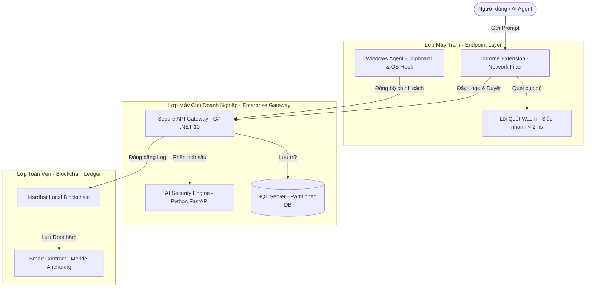

# 🛡️ AIGuard Control Tower - Hệ thống DLP & Bảo mật Zero-Trust cho AI Agent & Platforms

AIGuard Control Tower là giải pháp bảo mật toàn diện (DLP) đứng giữa người dùng/AI Agent của doanh nghiệp và các nền tảng Generative AI đám mây (như ChatGPT, Gemini, DeepSeek). Hệ thống thực hiện giám sát, phân loại, che giấu dữ liệu nhạy cảm theo thời gian thực tại máy trạm và bảo mật nhật ký kiểm toán chống thao túng bằng công nghệ Blockchain.

---

## 📐 Kiến trúc Hệ thống (System Architecture Overview)

Hệ thống bao gồm 5 phân hệ cốt lõi tương tác chặt chẽ với nhau:



1. **`aiguard-web` (Frontend):** Trang quản trị Control Tower (React, TypeScript, Vite) để cấu hình chính sách, xem telemetry thiết bị, phê duyệt yêu cầu (Approval Center), và xem nhật ký cá nhân (`My Usage`).
2. **`aiguard-api` (Backend):** Web API trung tâm (C# .NET 10, Entity Framework Core, SQL Server / SQLite) xử lý logic nghiệp vụ, phân quyền Zero-Trust, phân phối chính sách, quản lý Tenant SaaS và điều hành phê duyệt.
3. **`aiguard-ai` (AI Microservice):** Dịch vụ phân tích an ninh AI (Python FastAPI) sử dụng mô hình phân loại **Llama Guard 3** và thuật toán quét Regex nâng cao để chấm điểm rủi ro.
4. **`aiguard-extension` (Browser Extension):** Tiện ích Chrome (Manifest V3) đánh chặn dữ liệu Prompt ở tầng mạng (`declarativeNetRequest`), thực hiện tráo đổi thực thể nhạy cảm (Dynamic Masking) và hoàn nguyên (Unmasking) trên RAM.
5. **`aiguard-endpoint-agent` (Windows Agent):** Ứng dụng chạy ngầm hệ điều hành (C# WPF / Service) kiểm soát Clipboard, giám sát hoạt động thiết bị và đồng bộ chính sách bảo mật DLP.
6. **`aiguard-contracts` (Blockchain Ledger):** Hệ thống Smart Contract (Solidity / Hardhat) để neo Merkle Root của các lô log (Audit Logs) lên Blockchain, chống sửa xóa log.

---

## 🚀 Hướng Dẫn Khởi Chạy Toàn Hệ Thống

> [!IMPORTANT]
> **Thứ tự khởi chạy khuyến nghị:**
> 1. Khởi tạo Database (`database/production-idempotent.sql`)
> 2. Khởi chạy AI Security Engine (`aiguard-ai` - Cổng 8000)
> 3. Khởi chạy Backend API (`aiguard-api` - Cổng 5000/5001)
> 4. Khởi chạy Frontend Web (`aiguard-web` - Cổng 5173)
> 5. Cài đặt các phân hệ bổ trợ (`aiguard-extension`, `aiguard-endpoint-agent`, `aiguard-contracts`)

---

### 🗄️ Bước 1: Thiết lập Cơ Sở Dữ Liệu (SQL Server)

Hệ thống lưu cấu hình và log qua SQL Server (hoặc SQLite khi chạy Testing).
1. Mở công cụ quản lý cơ sở dữ liệu (SSMS hoặc Azure Data Studio).
2. Kết nối vào máy chủ SQL Server của bạn (ví dụ: `localhost` hoặc `.\SQLEXPRESS`).
3. Chạy file script SQL tại thư mục dự án: [production-idempotent.sql](file:///g:/Dự%20Án/DuAn2026/database/production-idempotent.sql) để tạo cơ sở dữ liệu `AiguardDb` và nạp dữ liệu mẫu.
4. Đảm bảo chuỗi kết nối trong cấu hình [appsettings.json](file:///g:/Dự%20Án/DuAn2026/aiguard-api/appsettings.json) của Backend API đã chính xác.

---

### 🐍 Bước 2: Chạy AI Security Engine (`aiguard-ai`)

Phân hệ AI phân tích và chấm điểm rủi ro, chạy tại cổng **8000**.
* **Yêu cầu:** Đã cài đặt Python 3.10+, pip, ảo hóa virtualenv (tùy chọn) hoặc Docker.

**Cách 1: Chạy trực tiếp qua script PowerShell (Windows)**
```powershell
cd aiguard-ai
# Chạy script PowerShell tự động setup môi trường ảo, cài thư viện và khởi động:
.\start-aiguard-ai.ps1
```

**Cách 2: Chạy thủ công bằng lệnh Python**
```bash
cd aiguard-ai
python -m venv venv
# Active môi trường ảo
venv\Scripts\activate      # Trên Windows
source venv/bin/activate    # Trên macOS/Linux

pip install -r requirements.txt
uvicorn app.main:app --host 127.0.0.1 --port 8000 --reload
```

**Cách 3: Chạy thông qua Docker**
```bash
cd aiguard-ai
docker build -t aiguard-ai .
docker run -p 8000:8000 aiguard-ai
```

---

### ⚙️ Bước 3: Chạy Backend API (`aiguard-api`)

Web API lõi của hệ thống, điều phối dữ liệu bảo mật.
* **Yêu cầu:** Đã cài .NET 10 SDK.

```bash
cd aiguard-api
# Khôi phục các gói thư viện NuGet
dotnet restore

# Biên dịch và khởi chạy dự án
dotnet run
```
*   **Địa chỉ chạy:** `http://localhost:5000` hoặc `https://localhost:5001`.
*   **Tài liệu API (Swagger):** Truy cập `http://localhost:5000/swagger` để xem tài liệu API chi tiết.

---

### 🎨 Bước 4: Chạy Frontend Web Admin (`aiguard-web`)

Trang quản trị vận hành trung tâm và trang Dashboard cá nhân.
* **Yêu cầu:** Đã cài đặt Node.js v18+.

```bash
cd aiguard-web
# Cài đặt thư viện dependencies
npm install

# Chạy ở chế độ phát triển (Development Mode)
npm run dev
```
*   **Địa chỉ truy cập:** 👉 **http://localhost:5173**

---

### 🔗 Bước 5: Chạy Blockchain Node & Smart Contracts (Tùy chọn)

Gom cụm nhật ký log và lưu vết bất biến lên Blockchain ảo.
* **Yêu cầu:** Node.js và Hardhat.

```bash
cd aiguard-contracts
npm install
# Khởi động Blockchain ảo local
npx hardhat node

# Mở một terminal mới để Deploy Smart Contract lên mạng local ảo đó
npx hardhat run scripts/deploy.js --network localhost
```

---

### 🛡️ Bước 6: Cài đặt Browser Extension & Windows Desktop Agent

*   **Browser Extension (`aiguard-extension`):**
    1. Truy cập `chrome://extensions/` trên Chrome.
    2. Bật chế độ nhà phát triển (**Developer mode**).
    3. Chọn **Load unpacked** (Tải tiện ích đã giải nén) và trỏ vào thư mục `aiguard-extension`.
*   **Windows Agent (`aiguard-endpoint-agent`):**
    1. Mở thư mục [aiguard-endpoint-agent](file:///g:/Dự%20Án/DuAn2026/aiguard-endpoint-agent).
    2. Build và xuất file exe tự chạy bằng Visual Studio hoặc qua terminal `dotnet build` / `dotnet publish`.

---

## 🔒 Danh Sách Tài Khoản Thử Nghiệm (Demo Accounts)

Sử dụng các tài khoản mặc định sau để đăng nhập vào trang quản trị tại `http://localhost:5173`:

| Nhóm Quyền (Role) | Email Đăng Nhập | Mật Khẩu | Menu Chức Năng Chính |
| :--- | :--- | :--- | :--- |
| **Platform Admin** (SaaS Owner) | `platform@aiguard.com` | `PlatformPassword@123` | CRM Khách hàng, Đơn hàng, Hóa đơn, Gói bán |
| **Tenant Owner** (Business Admin) | `admin@aiguard.com` | `Admin@123` | Quản trị nhân sự, Chính sách, Telemetry thiết bị |
| **Employee** (End User) | `nguyenvana@company.com` | `Employee@123` | Điểm an toàn cá nhân, Nhật ký hoạt động AI |

---

*Chúc các bạn chạy thử nghiệm thành công dự án AIGuard Control Tower! Mọi thắc mắc hoặc lỗi vui lòng tạo Ticket trên hệ thống Dashboard.*
